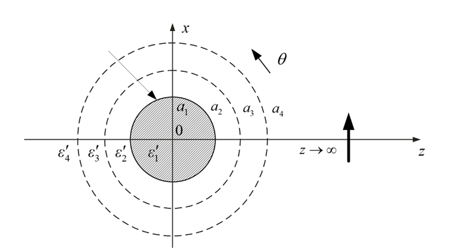
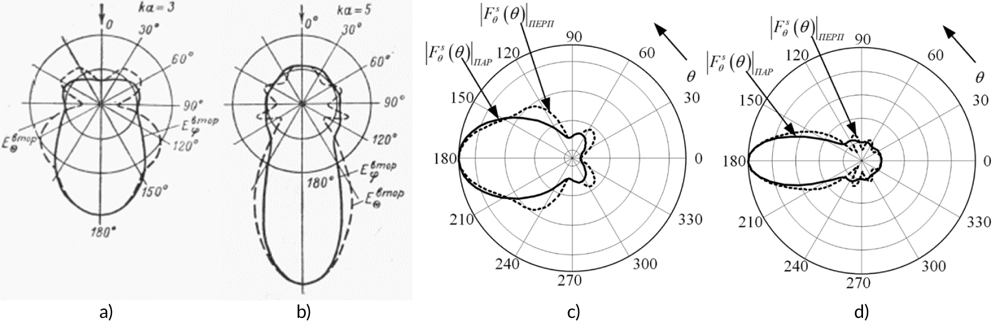
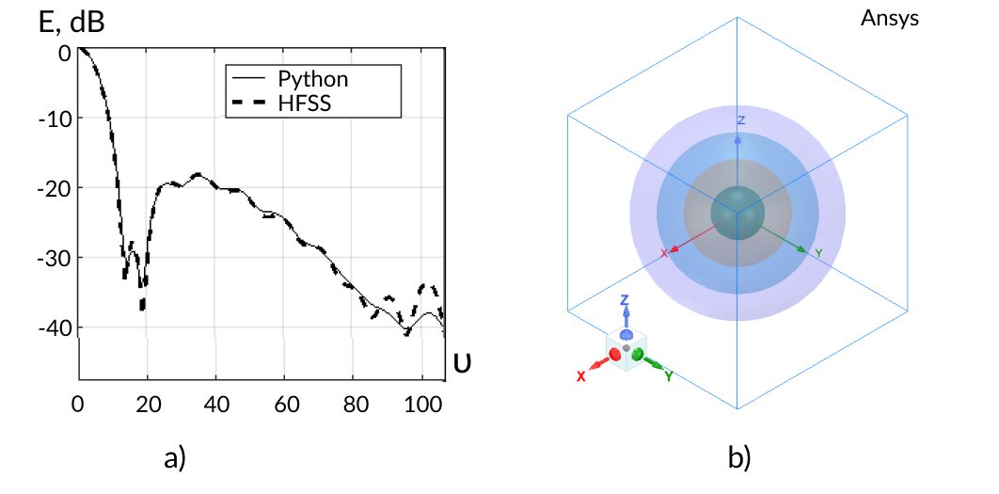

Intro
=====

Open Source Library for Solving Scattering Problems on Multilayer Spherical Bodies
------------

* D.V. Denisov - Candidate of Technical Sciences, Associate Professor at the Department of Information Technologies and Control Systems, Institute of Radio Electronics and Information Technology, Ural Federal University, Ekaterinburg. E-mail: dv.denisov@urfu.ru

* V.Ya. Noskov - Doctor of Technical Sciences, Professor at the Department of Radio Electronics and Telecommunications, Institute of Radio Electronics and Information Technology, Ural Federal University, Ekaterinburg. E-mail: v.y.noskov@urfu.ru

* I.O. Skumatenko - Software Developer, Ph.D. student at the Institute of Radio Electronics and Information Technology, Ural Federal University, Ekaterinburg. E-mail: ilya.skumatenko@urfu.ru

Introduction
------------

The paper discusses a developed open-source library in Python. The library is designed for solving excitation problems in heterogeneous spherical structures using the method of Tensor Green Function [1]. The solution is employed for the numerical computation of diffraction parameters on bodies of simple geometric shapes, enabling the assessment of general patterns and specific characteristics of the performance of shelters and the materials used for them.

Electrodynamic Apparatus
------------

The proposed library employs the electrodynamic apparatus of Tensor Green Functions (TGF) as the primary computational model. The methodology for using the TGF apparatus is outlined in [1], while a detailed solution for the excitation problem of a heterogeneous spherical structure and calculations in the Matlab software package are provided in [2].

Library Description
------------

The library consists of functions for computations, including:
Bessel and Neumann functions and their derivatives, impedances and admittances (Y and Z) for bound layers;
Hankel function and its derivative, and coefficients Mn and Nn for layers.
The usage instructions, licensing information, and details about input and output data formats are provided in the readme.txt file at the root of the repository [3].

Comparison of Methods and Previously Obtained Results
------------

As a validation of the accuracy of the obtained results, we present a comparison of solutions for some typical problems. The general geometry of the electromagnetic wave scattering problem on a multilayered spherical structure is illustrated in Figure 1.

   Fig. 1. Model of EM wave diffraction on a multilayered sphere

Let's calculate the diffraction of an electromagnetic wave on a conducting sphere and compare it with the results obtained in classical literature [4]. Figures 2a and 2b show the radiation patterns of the scattered field on a sphere with electrical size ka = 3 and ka = 5, respectively, excited by a plane wave, taken from [4]. In the right part of Figure 2c and 2d, the diagrams are calculated using the library.

   Fig. 2. Diagrams of the scattered field on a metallic sphere

Similarly, let's present the results of the diffraction calculation on a four-layer Luneburg lens. For simplicity, the layer parameters correspond to an equidistant approximation of the Luneburg law. In this problem setup, the incident electromagnetic wave has a frequency of 10 GHz, and the radius of the lens is 9 cm (ka ~ 19). Figure 3 provides a comparison of the scattering diagrams obtained in the Ansys Electronics Desktop software package (HFSS Design) and the Python library.

   Fig. 3. Scattering on the Luneburg lens (a) and problem setup in HFSS Design (b)	

Conclusions
------------

The software implementation exhibits significant computational efficiency and can be effectively utilized for preliminary analysis of volumetric dielectric structures, as well as for determining their diffraction and radar characteristics.

The work is based on:
------------

#. Panchenko, B. A. (2013). Scattering and Absorption of Electromagnetic Waves by Inhomogeneous Spherical Bodies. Moscow: Radiotekhnika.
#. Denisov, D. V. (2015). Antenna and Diffraction Characteristics of Luneburg Lenses under Circular Polarization Field Illumination: Thesis for the Degree of Candidate of Technical Sciences. Nizhny Novgorod: Nizhny Novgorod State Technical University named after R. E. Alekseev - NNGTU.
#. D.V. Denisov's GreenTensor Repository: GitHub. 2023. URL: https://github.com/Den1sovDm1triy/GreenTensor
#. Markov, G. T., & Chaplin, A. F. (1983). Excitation of Electromagnetic Waves. Moscow: Radio i Svyaz, 296 p.
