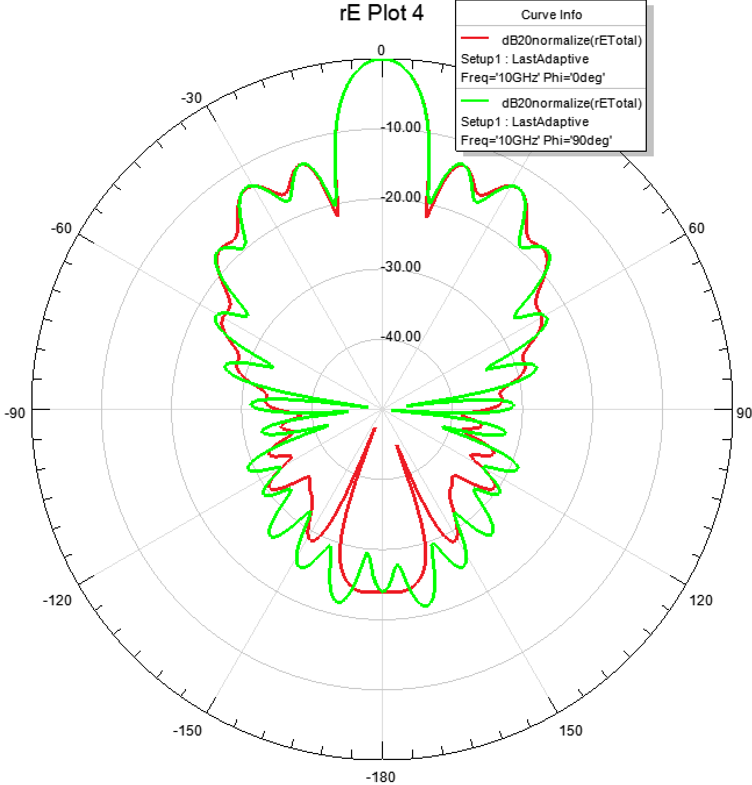
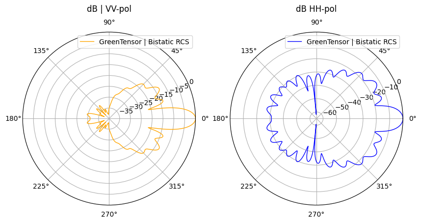
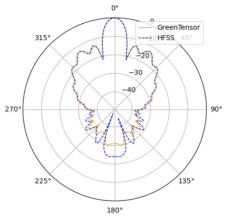
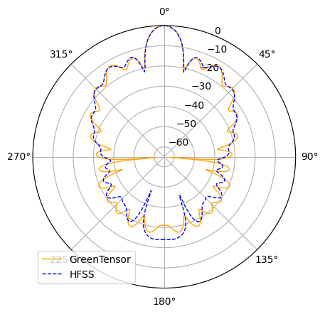

<!-- SPDX-License-Identifier: MIT -->

# Сравнение диаграмм рассеяния линзы Люнеберга

Этот репозиторий содержит скрипты для построения и сравнения диаграмм рассеяния Лунебурговской линзы, рассчитанных в **GreenTensor** и **HFSS**. 

## Структура репозитория

### Данные для расчетов
- **Ephi=0_from_HFSS.csv** – данные из **HFSS** для угла φ=0°.
- **Ephi=90_from_HFSS.csv** – данные из **HFSS** для угла φ=90°.

### Скрипты для построения графиков
- **plot_polar.py** – построение полярного графика по данным HFSS.
- **plot_rectengular.py** – построение графика в декартовой системе координат.
- **plot_compare_GreenTensor_HFSS.py** – сравнение данных из **HFSS** и **GreenTensor**.

### Основной расчетный код
- **Luneburg_Lens_Scattering_Diagram.py** – расчет диаграмм рассеяния для Лунебурговской линзы с разным числом слоев. Включает:
  - Задание параметров линзы.
  - Расчет коэффициентов рассеяния.
  - Построение диаграмм в полярной системе координат.

### Графики (результаты расчетов)

---

## Установка и запуск

### Установка зависимостей
Для работы скриптов требуется **Python 3.8+** и библиотеки:
- numpy
- matplotlib
- pandas
- scipy

### Запустить файл на исполнение
Для корректного построения диаграмм сравнения с HFSS потребуется загрузка файлов Ephi=0_from_HFSS.csv и Ephi=90_from_HFSS.csv во временное окружение google colab.
[Google Colab](https://colab.research.google.com/drive/11t4wbYpwCCJJ9_bMZPXZzCcctwAS6nW6#scrollTo=ubAabPSgV6IT).

